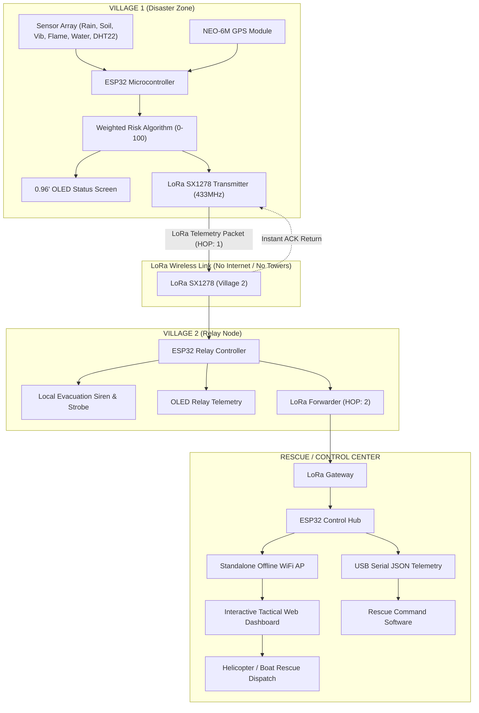

# 🛰️ Smart India Hackathon (SIH) — IoT Multi-Village Disaster Management & Emergency Mesh Network

[](LICENSE)
[](https://espressif.com)
[](https://semtech.com)
[]()

> **Real-World Problem:** During Himalayan flash floods & cloudbursts (e.g., Nepal Aug 2026, Chamoli, Wayanad), mobile towers collapse, bridges wash away, and isolated villages lose all communication.
> 
> **Our Solution:** A completely decentralized, solar-powered, offline **LoRa Mesh + Multi-Sensor Early Warning System** that evaluates a multi-parameter weighted risk score, acquires real-time GPS coordinates, relays emergency alerts across villages without cellular/internet, and delivers tactical rescue dispatch data to command centers.

---

## 🏗️ System Architecture & Data Flow



---

## 📂 Modular System Architecture

```
c:/SIH/
├── frontend/                     # React 18 + Vite Web Dashboard (Port 5173)
│   ├── src/
│   │   ├── components/           # Leaflet Map, Sensor Charts, Village Cards, Terminal, Modals
│   │   ├── hooks/                # useDisasterWebSocket Real-Time Hook
│   │   └── utils/                # Web Audio API Siren Synthesizer
│   ├── index.html
│   └── package.json
│
├── backend/                      # Express.js REST API + WebSocket Server (Port 8080)
│   ├── server.js                 # Master API & WebSocket Server
│   ├── simulator.js              # Rayagada multi-hop simulation engine
│   ├── routes/apiRoutes.js       # /api/nodes, /api/telemetry/history, /api/dispatch
│   └── package.json
│
├── database/                     # SQLite Relational Database Engine
│   ├── db.js                     # Async SQLite connection pool
│   ├── schema.sql                # SQL Schema & Rayagada initial seed records
│   ├── models/                   # NodeModel, TelemetryModel, DispatchModel
│   └── disaster_management.db    # Auto-created persistent SQLite database file
│
├── hardware_firmware/            # ESP32 C++ Production Sketches
│   ├── Node1_Disaster_Sensor_Node/
│   ├── Node2_Relay_Node/
│   ├── BaseStation_Control_Center/
│   └── CIRCUIT_DIAGRAM_PINOUT.md
│
└── README.md                     # Master Documentation & SIH Pitch Guide
```

---

## 📦 Required Arduino IDE Libraries

Install the following libraries via Arduino IDE Library Manager (**Sketch -> Include Library -> Manage Libraries**):

1. `LoRa` by Sandeep Mistry (v0.8.0+)
2. `WebSockets` by Markus Sattler (v2.4.1+) — *Required for real-time WebSocket streaming on Base Station*
3. `Adafruit SSD1306` by Adafruit (v2.5.7+)
4. `Adafruit GFX Library` by Adafruit
5. `TinyGPSPlus` by Mikal Hart (v1.0.3+)
6. `DHT sensor library` by Adafruit (v1.4.4+)
7. `Adafruit Unified Sensor`

---

## 💰 Bill of Materials (BOM) & Cost Feasibility

| Component | Quantity (Per Node) | Cost (INR) |
|---|---|---|
| ESP32 DevKit V1 (30-Pin) | 1 | ₹350 |
| SX1278 LoRa 433MHz Module | 1 | ₹450 |
| NEO-6MV2 GPS Module | 1 | ₹400 |
| 0.96" I2C OLED Display | 1 | ₹150 |
| Sensor Suite (Rain, Soil, Vib, Temp, Flame, Ultrasonic) | 1 set | ₹300 |
| 6V 2W Solar Panel + TP4056 + 18650 Li-Ion Cell | 1 set | ₹650 |
| **Total Cost Per Node** | — | **₹2,300 (~$28 USD)** |
| **Total 3-Node Demonstration Network** | — | **₹6,900** |
| *Satellite Phone Alternative* | *1 device* | *₹50,000+ plus ₹5,000/mo subscription* |

---

## 🚀 How to Run the System

### Option A: Uploading to ESP32 Hardware (Direct WebSocket)
1. Connect Node 1 ESP32 to PC and upload [Node1_Disaster_Sensor_Node.ino](file:///c:/SIH/Node1_Disaster_Sensor_Node/Node1_Disaster_Sensor_Node.ino).
2. Connect Node 2 ESP32 to PC and upload [Node2_Relay_Node.ino](file:///c:/SIH/Node2_Relay_Node/Node2_Relay_Node.ino).
3. Connect Base Station ESP32 to PC and upload [BaseStation_Control_Center.ino](file:///c:/SIH/BaseStation_Control_Center/BaseStation_Control_Center.ino).
4. Connect laptop or phone to WiFi SSID `SIH_DISASTER_RESCUE_HQ` (password: `emergency123`).
5. Open browser at `http://192.168.4.1` — WebSocket connects automatically to `ws://192.168.4.1:81/` for instant sub-millisecond updates!

### Option B: USB Serial + Python WebSocket Bridge
1. Connect Base Station ESP32 to laptop via USB cable.
2. Run the bridge:
   ```bash
   pip install websockets pyserial
   python gateway_bridge.py --port COM3 --baud 115200 --ws_port 8080
   ```
3. Open [Dashboard/index.html](file:///c:/SIH/Dashboard/index.html), enter `ws://localhost:8080/` in the top input box and click **Connect**.

### Option C: Standalone Zero-Hardware Simulation Mode
1. Run the Python simulator:
   ```bash
   python gateway_bridge.py --simulate --ws_port 8080
   ```
2. Open [Dashboard/index.html](file:///c:/SIH/Dashboard/index.html) to see live animated charts, moving map markers, radio terminal logs, and live audio sirens!

